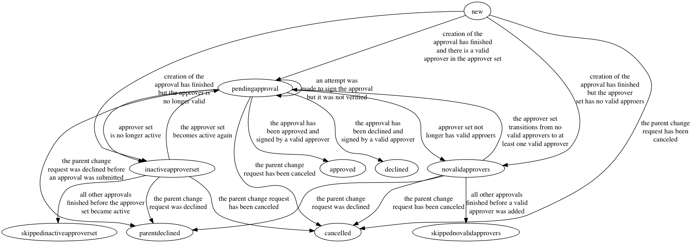

# Approval

## Fields

### ID

The ID of the Approval object

### State

The state of the Approval is used to determine if the approval has
been granted to declined from the view of the parent Change Request
object.

### IsSigned

IsSigned will be true only when a valid Approver has submitted a
signed message either approving or declining the Change Request.

### ChangeRequestID

The ID of the parent Change RequestÂ

### ApproverSetID

The Approver Set that must be used to Approve or Decline the request

### Signature

The GPG signed attestation stating that the approver either approved
or decline the change request.

## States

### new

An Approval in the *new* state has been created but has not been
released for approval yet.

Next State(s) :
* *pendingdapproval* : After the Change Request and all required
   Approvals have been created.
* *cancelled* : The Approval, Change Request or Revision has been
   cancelled before the Change Request has finished being created.
* *novalidapprovers* : The creation of the Change Request has completed
   but the approver set has no valid approvers associated with it
* *inactiveapproverset* : The creation of the Change Request has
   completed but the approver set is in the inactive state.

### pendingapproval

The Approval object is waiting for an Approver from the Approver Set to
either Approver or Decline the change request.

Next State(s) :
* *pendingapproval* : An approval attempt was made but it did not work
   for some reason.
* *cancelled* : The Revision or Change Reqeust was cancelled.
* *approved* : An Approval was submitted that was approving the Change
   Request
* *declined* : An Approval was submitted that declined the Change
   Request
* *novalidapprovers* : The Approver Set associated with the Approval
   no longer has any valid Approvers
* *inactiveapproverset* : The Approver Set associated with the Approval
   has become inactive.

### cancelled

The Change Request of Revision associated with the Approval has been
cancelled.

This is a terminal state

### approved

The Approval has been approved by a valid Approver in the Approver Set.

This is a terminal state

### declined

The Approval has been declined by a valid Approver in the Approver Set.

This is a terminal state

### novalidapprovers

The Approver Set associated with the Approval does not have any valid
Approvers associated with and the parent Change Request has not been
declined, cancelled or fully approved yet.

Next State(s):
* *pendingapproval* : The Approver Set transitions to having at least
   one valid approver
* *skippednovalidapprovers* : The Change request transitions to an
   approved stated before the Approver Set associated with the
   Approval gains valid approvers
* *cancelled* : The Change Request or Revision is cancelled before
   the Approver Set associated with the Approval gains valid approver
* *parentdeclined* : The Parent Change request was declined

### skippednovalidapprovers

The Change Request was approved by all other Approvals that were not
candidates for skipping (Approvals in the *inactiveapproverset* or
*novalidapprovers* states) before the Approver Set associated with the
Approval had any valid Approvers.

This is a terminal state

### inactiveapproverset

The Approver Set associated with the Approval is in the *inactive*
state and the parent Change Request has not been declined, cancelled
or fully approved yet.

Next State(s):
* *pendingapproval* : The Approver set has become *active* again
* *skippedinactiveapproverset* : The Approver set was *inactive* when
   all other required Approvals were completed or were candidates for
   skipping.
* *cancelled* : The parent Change Request or Revision was cancelled
* *parentdeclined* : One of the approvals for the Change Request was
   declined
}
### skippedinactiveapproverset

The Change Request was approved by all other Approvals that were not
candidates for skipping (Approvals in the *inactiveapproverset* or
*novalidapprovers* states) before the Approver Set's state changed to
active.

This is a terminal state

### parentdeclined

One or more of the Approvals associated with the parent Change
Request was declined.

This is a terminal state

## TODO
* Add "ApprovedAt" and "ApprovedBy" fields
