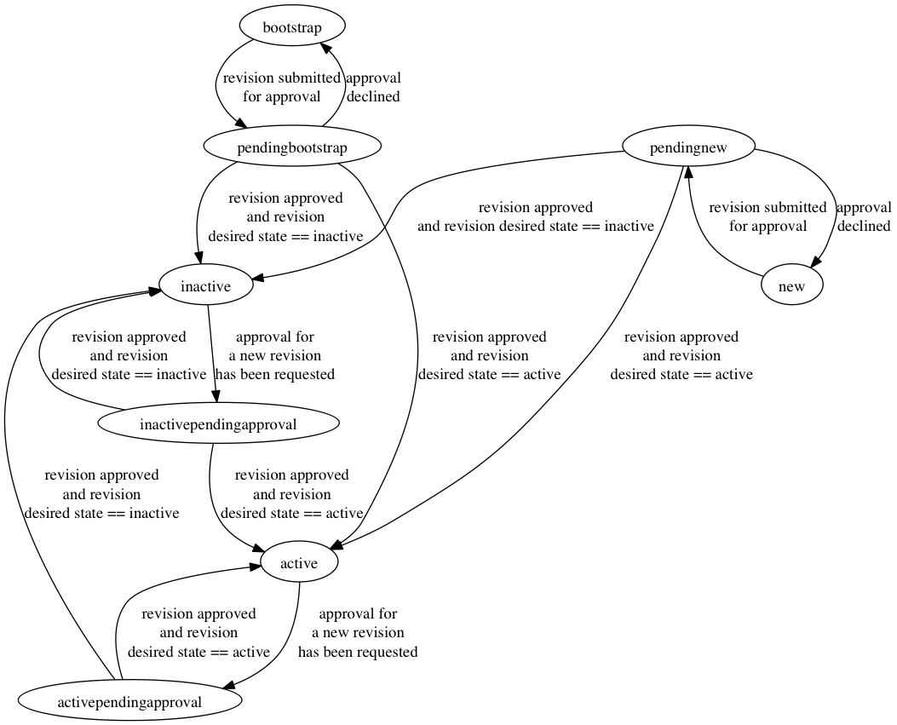

# Approver

An Approver is an object that represents a person who can make
approval decisions. Approvers must be a member of an Approver set in
order to make approvals. An individual may have multiple Approvers
associated to them to act in different roles but it is not
recommended.

## Fields

### ID

The ID of the Approver object

### EmailAddress

An email address that can be used to contact the approver defined in
the revisions.

TODO: Move the email address into the revision body

### Role

The role of the approver object defined in the revisions.

TODO: Move the role into the revision body

### State

The State of the Approver will dictate the current state of the
approver object. If an approver has one of the following states, it
may be used to grant approvals for ApproverSets that it is a member
of:
  * *active*
  * *activependingapproval*
  * *pendingbootstrap* (only to approval itself)

## States

### new

An Approver in the *new* state has been created and does not have an
open change request. A revision must be created before a change
request may be submitted. An Approver in the *new* state may also
have had a change request submitted for approval and the approval may
have been declined.

Next State(s) :
* *pendingnew* : When a change request has been submitted for
   approval

### pendingnew

An Approver in the *pendingnew* state has a revision that has a
submitted change request that is pending approval.

Next State(s):
* *new* : When a change request has been declined
* *active* : When a change request has been approved and the desired
   state is set to "active"
* *inactive* : When a change request has been approved and the
   desired state is set to "inactive"

### active

An Approver with the state of *active* has an active revision which
has the desired state of *active*. (For an Approver to have a current
revision with a desired state of "active" there must be an approved
change request)

Next State(s):
* *activependingapproval* : When a change request has been submitted
   for the Approver.

### inactive

An Approver with the state of *inactive* has an active revision which
has the desired state of *inactive*. (For an Approver to have a
current revision with a desired state of "inactive" there must be an
approved change request)

Next State(s):
* *inactivependingapproval* : When a change request has been
   submitted for the Approver.

### activependingapproval

An Approver with the state *activependingapproval* has a current
revision that has been approved with the desired state of "active"
and a revision that is pending approval.

Next State(s):
* *inactive* : When the pending change request has been Approved and
   the desired state of the revision is set to "inactive".
* *active* : When the pending change request has been Approved and
   the desired state of the new revision is set to "active" or the
   change request has been declined.

### inactivependingapproval

An Approver with the state *inactivependingapproval* has a current
revision that has been approved with the desired state of "inactive"
and a revision that is pending approval.

Next State(s):
* *inactive* : When the pending change request has been Approved and
   the desired state of the revision is set to "inactive" or the
   change request has been declined.
* *active* : When the pending change request has been Approved and
   the desired state of the new revision is set to "active" .

### bootstrap (special case)

The bootstrap state is a special case only used for creating a new
instance of AkaRegistrar. An approver in the bootstrap state can only
be used to approver itself (usually as the only member of a approver
set which is also in the bootstrap phase).

Next State(s):
* *pendingbootstrap* : when submitted for approval

### pendingbootstrap (special case)

Approvers in this state are pending approval but were originally in
the bootstrap state.

Next State(s):
* *bootstrap* : when change request is declined
* *inactive* : when the change request is approved and the desired
   state of the revision is set to "inactive" (will not happen in
   most cases)
* *active* : when the change request is approved and the desired
   state of the revision is set to "active"

## TODO
* func GetDiff: Handle diff for objects that do not have a pending
  revision
* func GetDiff: Handle diff for objects that do not have a current
  revision
* type ApproverExportShort: Candidate for removal
* type ApproversPage: Add paging support
* func HasRevision: add a check to verify that the current revision
  has an approved change request
* func SuggestedRevisionValue: add other fields that have been added
* func SuggestedRevisionValue: add version for approver sets
* func ParseFromForm: verify email address
* func GetAllPage: Add paging support
* func GetAllPage: Add filtering
