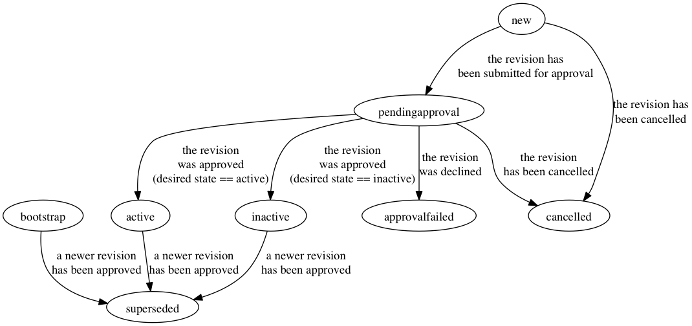

# Approver Revision

An Approver Revision is an object that holds a possible revision for
an Approver. The fields and states of the Approver Revisions can be
found below.

## Fields

### ID

The ID of the Approver Revision object

### ApproverID

The ID of the parent Approver object

### RevisionState

The state of an Approver Revision dictates the current state of the
revision object. If an Approver Revision is the "current revision" of
an Approver it must have the state of *bootstrap* or *active* to be
used to approver change requests (the *bootstrap* may only be used to
approve Change Requests for its own parent Approver). The full state
machine is documented below.

### DesiredState

The desired state field can have three possible values, "active",
"inactive" or "bootstrap". The "bootstrap" desired state shall only
be used when there are no valid Approvers in the system and can only
be used as an approver to approve its parent Approver in the
*pendingbootstrap* state. When the Approver Revision has a desired
state of "active" and it has been approved the contents of the
revision can be used for approval purposes. When an Approver Revision
has a desired state of "inactive" it may not be used for approval
purposes. "inactive" revisions can be used to indicate Approver who
are no longer with the organization or have switched roles within the
organization and are no longer used.

### Name

Name represents the name of the person who is described in the
revision. In most cases the name field will stay constant but it can
be edited in the event that a name change occurs (or to make a name
more specific).

### Username

Username representes the registrar username when used internally and can
be repurposed to hold other usernames if necessary.

### EmployeeID

EmployeeID is used to hold a unique ID for the user within the
organization. There have been rare cases where usernames have been
reused but it is assumed that EmployeeID will remain unique per
organization.

### Department

Department is another field that can be used to help identify a user
within an organization. This field will usually stay the same unless
a user transitions to a different organization.

### Fingerprint

Fingerprint should contain the GPG fingerprint of the Public Key
associated with the user. The fingerprint can be obtained by running
`gpg --fingerprint %EMAILADDRESS%` and searching for the line that
begins with "Key fingerprint = ".

### PublicKey

PublicKey should contain the armored public key of the Approver. The
armored public key can be obtained by running `gpg --armor --export
%EMAILADDRESS%`

## States

### new

An Approver Revision in the *new* state has been created but does not
have an open change request created. The revision may still be edited
when in the new phase but once it is submitted for approval or
cancelled it becomes locked and cannot be edited.

Next State(s) :
* *pendingapproval* : When a change request has been submitted for
  the revision
* *cancelled* : When the revision has been cancelled (a soft delete)

### pendingapproval

An Approver Revision in the *pendingapproval* state has an open
Change Request which is awaiting approval.

Next State(s) :
* *approvalfailed* : If the change request is declined by more than
  one of the required approver sets
* *active* : If the change request is approved by all required
  approver sets and the desired state is set to "active"
* *inactive* : If the change request is approved by all the required
  approver sets and the desired state is set to "inactives"

### active

An Approver Revision is *active* when it has a been approved by a
change request while having the desired state field set to "active"
and is still the current revision for the Approver object.

Next State(s) :
* *superseded* : When a new revision has been approved

### inactive

An Approver Revision is *active* when it has a been approved by a
change request while having the desired state field set to "active"
and is still the current revision for the Approver object.

Next State(s) :
* *superseded* : When a new revision has been approved

### approvalfailed

An Approver Revision will have the state of *approvalfailed* if the
change request opened to approve the object has one or more approver
sets who have declined the approval for the change request. To
restart the change another revision and change request must be
created.

This is a terminal state

### cancelled

An Approver Revision will have the state of *cancelled* if it or its
change request was cancelled by the user that created the revision.

This is a terminal state

### superseded

An Approver Revision will have the state of *superseded* after a new
revision has been moved into either the active or inactive state
after being approved.

This is a terminal state

### bootstrap (special case)

An Approver Revision with the state of *bootstrap* may only be used
as an approver for its own parent approver. Once the approval has
taken place the revision will move to superseded and cannot be cloned
or used for another approver revision.

Next State(s) :
* *superseded*

## TODO
* Add start current
* Add end current
* ensure that only the revision creator can cancel the revision
* ensure that the bootstrap state can only be used to approver the
  parent approver
* add revision cloning (dont copy state)
* cannot clone approver revision
* type ApproverRevisionsPage : Add paging support
* func StartApprovalProcess : Check if a CR already exists for this
  object
* func StartApprovalProcess : Ensure that if an error occurs no
  changes are made
* func ParseFromForm : verify public key
* func ParseFromForm : verify fingerprint
* func ParseFromFormUpdate : verify public key
* func ParseFromFormUpdate : verify fingerprint
* func GetAllPage : Add paging support
* func GetAllPage : Add filtering
* func Cancel : If in pending approval, cancel the change request and
  all approval objects
* func GetActions : handle all states
