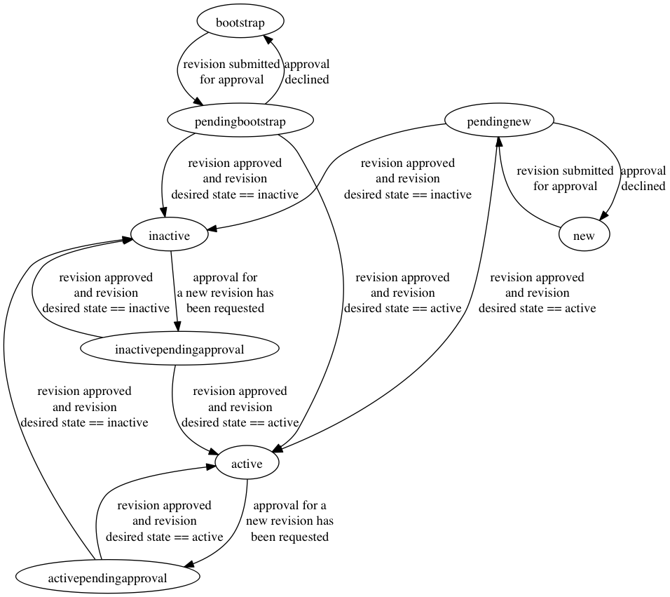

# Approver Set

An Approver Set is an object that represents a collection of
approvers that are allowed to make approvals on behalf of a shared
purpose. Examples fo groups that might be used in this case would be
multiple people from the Information Security department who can all
approve requests on behalf of the InfoSec group.

## Fields

### ID

The ID of the Approver Set object

### Title

The name that has been given to the Approver Set object. Examples may
be the department or group name that is shared between the approvers
that will be included.

### State

The State of the Approver Set will dictate the current state of the
approver set object. If an Approver Set has one of the following
states, it may be used to grant approvals:
* *active*
* *activependingapproval*
* *bootstrap* (only to approve an Approver in *pendingbootstrap*)
* *pendingbootstrap* (only to approve itself or an Approver in
    *pendingbootstrap*)

### Description

A short description of the reason for the Approver Set and possibly a
link to a page where documentation can be found about the Approver
Set

## States

### new

An Approver Set in the *new* state has been created and does not have
an open change request. A revision must be created before a change
request may be submitted. An Approver Set in the *new* state may also
have had a change request submitted for approval and the approval may
have been declined.

Next State(s) :
* *pendingnew* : When a change request has been submitted for
   approval

### pendingnew

An Approver Set in the *pendingnew* state has a revision that has a
submitted change request that is pending approval.

Next State(s):
* *new* : When a change request has been declined
* *active* : When a change request has been approved and the desired
   state is set to "active"
* *inactive* : When a change request has been approved and the
   desired state is set to "inactive"

### active

An Approver Set with the state of *active* has an active revision
which has the desired state of *active*. (For an Approver Set to have
a current revision with a desired state of "active" there must be an
approved change request)

Next State(s):
* *activependingapproval* : When a change request has been submitted
   for the Approver Set.

### inactive

An Approver Set with the state of *inactive* has an active revision
which has the desired state of *inactive*. (For an Approver Set to
have a current revision with a desired state of "inactive" there must
be an approved change request)

Next State(s):
* *inactivependingapproval* : When a change request has been
   submitted for the Approver Set.

### activependingapproval

An Approver Set with the state *activependingapproval* has a current
revision that has been approved with the desired state of "active"
and a revision that is pending approval.

Next State(s):
* *inactive* : When the pending change request has been Approved and
   the desired state of the revision is set to "inactive".
* *active* : When the pending change request has been Approver Set
   and the desired state of the new revision is set to "active" or
   the change request has been declined.

### inactivependingapproval

An Approver Set with the state *inactivependingapproval* has a
current revision that has been approved with the desired state of
"inactive" and a revision that is pending approval.

Next State(s):
* *inactive* : When the pending change request has been Approved and
   the desired state of the revision is set to "inactive" or the
   change request has been declined.
* *active* : When the pending change request has been Approved and
   the desired state of the new revision is set to "active" .

### bootstrap (special case)

The bootstrap state is a special case only used for creating a new
instance of the Registrar. An Approver Set in the bootstrap state can
only be used to approver itself and an Approver in the bootstrap
phase. The Approver in the bootstrap state must be approved before
the Approver Set in the bootstrap state may be approved.

Next State(s):
* *pendingbootstrap* : when submitted for approval

### pendingbootstrap (special case)

Approver Sets in this state are pending approval but were originally
in the bootstrap state.

Next State(s):
* *bootstrap* : when change request is declined
* *inactive* : when the change request is approved and the desired
   state of the revision is set to "inactive" (will not happen in
   most cases)
* *active* : when the change request is approved and the desired
   state of the revision is set to "active"

## TODO
* type ApproverSet : Move title into the approversetrevision object
* type ApproverSet : Move Description into the approversetrevision
  object
* func GetDiff : add logic to create diff
* type ApproverSetsPage : Add paging support
* type ApproverSetsPage : Add filtering support
* func GetExportVersion : add CurrentRevision
* func GetExportVersion : Add PendingRevision
* func HasRevision : add a check to verify that the current revision
  has an approved
* func ParseFromFormUpdate : implement
* func PostUpdate : implement
* func UpdateState : implement
* func GetAllPage : Add paging support
* func GetAllPage : Add filtering
* func IsValidApproverByEmail : Check for approver being active
* func IsValidApproverByEmail : Check for special case of bootstrap
