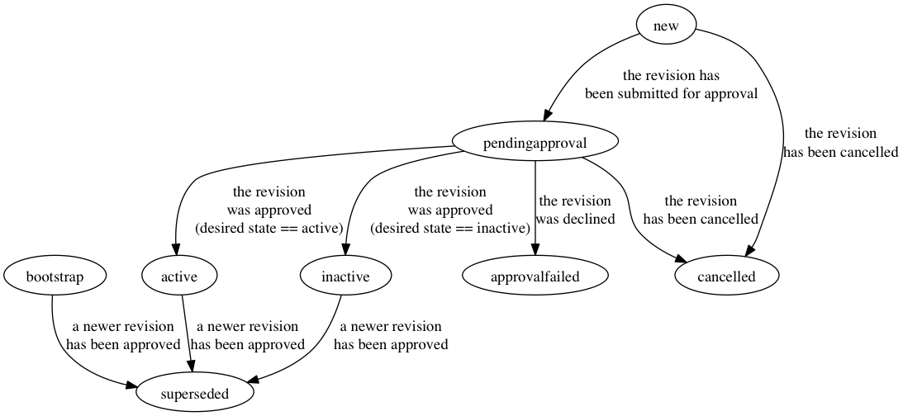

# Approver Set Revision

An Approver Set Revision is an object that holds a possible revision
for an Approver Set. The fields and states of the Approver Set
Revision object can be found below.

## Fields

### ID

The ID of the Approver Set Revision object

### ApproverSetID

The ID of the parent Approver Set object

### RevisionState

The state of an Approver Set Revision dictates the current state of
the revision object. If an Approver Set Revision is the "current
revision" of an Approver it must have the state of *bootstrap* or
*active* to be used to approver change requests (the *bootstrap* may
only be used as the Approver Set for a Change Requests for its own
parent Approver Set or an Approver in the *pendingbootstrap* state ).
The full state machine is documented below.

### DesiredState

The desired state field can have three possible values, "active",
"inactive" or "bootstrap". The "bootstrap" desired state shall only
be used when there are no valid Approver Sets in the system and
can only be used as an approver to approve its parent Approver Set
and an Approver which is in the *pendingbootstrap* state. When the
Approver State has a desired state of "active" and it has been
approved the contents of the revision can be used for approval
purposes. When an Approver Set Revision has a desired state of
"inactive" it may not be used for approval purposes. "inactive"
revisions can be used to indicate approver sets that are no longer
needed.

### Approvers

Approvers is a list of Approver objects that are members of an
Approver set.

## States

### new

An Approver Set Revision in the *new* state has been created but does
not have an open change request created. The revision may still be
edited when in the new phase but once it is submitted for approval or
cancelled it becomes locked and cannot be edited.

Next State(s) :
* *pendingapproval* : When a change request has been submitted for
  the revision
* *cancelled* : When the revision has been cancelled (a soft delete)

### pendingapproval

An Approver Set Revision in the *pendingapproval* state has an open
Change Request which is awaiting approval.

Next State(s) :
* *approvalfailed* : If the change request is declined by more than
  one of the required approver sets
* *active* : If the change request is approved by all required
  approver sets and the desired state is set to "active"
* *inactive* : If the change request is approved by all the required
  approver sets and the desired state is set to "inactives"

### active

An Approver Set Revision is *active* when it has a been approved by a
change request while having the desired state field set to "active"
and is still the current revision for the Approver Set object.

Next State(s) :
* *superseded* : When a new revision has been approved

### inactive

An Approver Set Revision is *active* when it has a been approved by a
change request while having the desired state field set to "active"
and is still the current revision for the Approver Set object.

Next State(s) :
* *superseded* : When a new revision has been approved

### approvalfailed

An Approver Set Revision will have the state of *approvalfailed* if
the change request opened to approve the object has one or more
approver sets who have declined the approval for the change request.
To restart the change another revision and change request must be
created.

This is a terminal state

### cancelled

An Approver Set Revision will have the state of *cancelled* if it or
its change request was cancelled by the user that created the
revision.

This is a terminal state

### superseded

An Approver Set Revision will have the state of *superseded* after a
new revision has been moved into either the active or inactive state
after being approved.

This is a terminal state

### bootstrap (special case)

An Approver Set Revision with the state of *bootstrap* may only be
used as an approver for its own parent Approver Set or for an
Approver in the *pendingbootstrap* state. Once the approval has
taken place the revision will move to superseded and cannot be cloned
or used for another approver revision.

Next State(s) :
* *superseded* : When a new revision has been approved

## TODO
* type ApproverSetRevisionsPage : Add paging support
* type ApproverSetRevision : Add StartApprovalProcess
