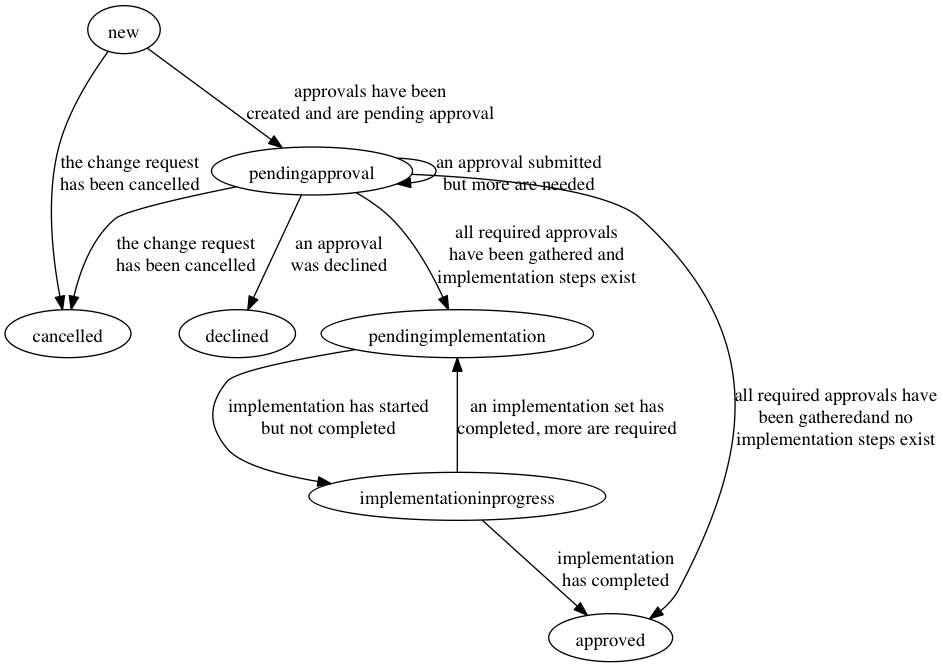

# Change Request

A Change Request is an object that represents a request to change from
one revision of an object to another. The fields and states of the
Change Request object can be found below.

## Requirements

For an approval to take place, there must be at least one valid
approval where the Approver has approved the change.

## Fields

### ID

The ID of the Change Request object

### RegistrarObjectType

The type of the Registrar Object that be being approved.

### RegistrarObjectID

The ID of the Registrar object that is being approved

### State

The current state of the Change Request. The states are documented
below.

### InitialRevisionID

The ID of the current revision of the object that is up for approval
if there is a current revision.

### ProposedRevisionID

The ID of the pending revision that is being proposed.

### ChangeJson

A JSON representation of the change that is being requested.

### ChangeDiff

A diff representation of the change being requested.

### Approvals

An array of Approval objects associated with the change request.

## States

### new

Change requests start here. A Change Request remains in this state
until it is either cancelled, declined or gets one approval.

Next State(s) :
* *cancelled* : The original requester has requested that the Change
   Request be cancelled
* *declined* : At least one approver set has declined the Change
   Request
* *pendingapproval* : At least one approver set has approved the
   Change Request
* *approved* : All of the required approvals have been submitted (in
   this case most likely 1)

### cancelled

The Change Request has been cancelled by the person that has request
the Change Request.

This is a terminal state

### declined

The Change Request's approvals has been declined by one more more
Approver Sets

This is a terminal state

### pendingapproval

The Change Request has at least one Approval that has been approved but
has not completed the approval process.

Next State(s) :
* *cancelled* : The original requester has requested that the Change
   Request be cancelled
* *declined* : At least one approver set has declined the Change
   Request
* *pendingapproval* : An Approval has been approved but not all
   required Approvals have been approved.
* *approved* : All of the required approvals have been submitted and no
   implementation steps exist for the approval
* *pendingimplementation*: All of the required approvals have been
   submitted and there are pending implementation steps

### approved

All required Change Request Approvals have been approved.

This is a terminal state

### pendingimplementation

The Change Request has been approved and is waiting to be
implemented.

Next State(s) :
* *implementationinprogress* : The process of implementing at least
   one of the implementation steps has started.

### implementationinprogress

There is an implementation step that is currently in progress but has
not yet completed.

Next State(s) :
* *approved* : All implementation steps have been completed
* *pendingimplementation* : An implementation step has been
   completed but not all steps are done.

## TODO
* Add implementation steps to a change request
